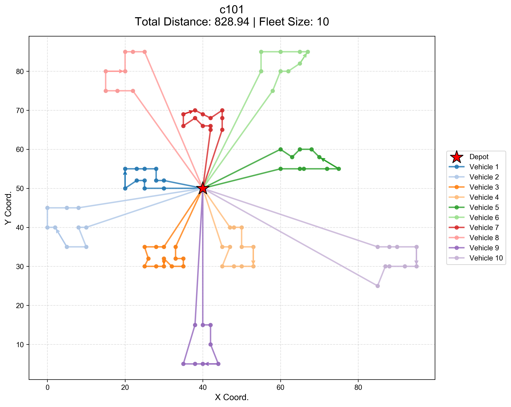

# Vehicle Routing Problem with Time Windows: Bi-Level Optimization

A VRPTW solver inspired by **MMOEA-DL** (IEEE TEVC 2025) — a deep reinforcement learning assisted multimodal multi-objective bi-level optimization method for multi-robot task allocation.

---

## Project Overview

A bi-level optimization solver for the **Vehicle Routing Problem with Time Windows (VRPTW)**:

- **Upper level**: Memetic Evolution Algorithm - assign customers to vehicle routes (task allocation)
- **Lower level**: DRL Gated Recurrent Network + Large Neighborhood Search - sequence customers within each route (path planning)

Following the MMOEA-DL paradigm, we combine evolutionary exploration at the upper level with learned (DRL) and local search (LNS) exploitation at the lower level.

---

## How to run

1. Clone the repo.
2. Set up your environment using `environment.yml`.
3. Set epochs in `src/train_nazari.py`.
4. Run `src/train_nazari.py`. Weights are saved in `checkpoints/`.
5. Run `src/main.py`.

## Reference

**MMOEA-DL**: Fan et al., "A Deep Reinforcement Learning-Assisted Multimodal Multi-Objective Bi-Level Optimization Method for Multi-Robot Task Allocation," *IEEE TEVC*, 2025.

